# **Proceso de los datos**
 

Aquí se define la arquitectura y el modelo de datos que se utilizara en el proyecto. Elegimos Google Cloud porque sus servicios profesionales de IA, el cifrado de datos y el rápido crecimiento de la cuota de mercado nos brindan una ventaja competitiva en el desarrollo de aplicaciones.

- Primero, se describe la plataforma tecnológica elegida, destacando las características y capacidades de Google Cloud, y el flujo de datos desde el almacenamiento sin procesar hasta la preparación de la solución propuesta.

- En segundo lugar, los procesos automatizados que respaldan el ciclo de vida de los datos se detallan utilizando las herramientas y los servicios en la nube de Google para optimizar las tareas relacionadas con el procesamiento y el análisis de datos.
 
- Finalmente, proporciona información sobre estructuras de datos y relaciones entre diferentes entidades, creando un marco sólido para almacenar, administrar e integrar datos en nuestras aplicaciones de Google Cloud.

 

# **Stack Tecnológico**

**Google Cloud Plataform (GCP)**

- Drive (datos crudos de gmaps y yelp)
- Visual Studio Code
- Google Cloud Storage
- Mage.ai - Docker
- Google BigQuery
- Hugging Face
- Github
- Locker
- Streamlit

 

Una de las cosas más importantes de este proyecto es el tratamiento y organización de los datos. A continuación se muestra el esquema del proceso de datos.
- Para integrar un esquema de los datos que fuera útil para el desarrollo de la aplicación se descargaron los datos crudos del drive, de manera local y se trabajaron con Visual Studio Code, la data transformada en .csv se subio a Google Storage, para poder ser trabajados.
- Los datos al estar en Google Storage, pueden ser extraidos en Mage, donde podemos realizar el ETL en dicha aplicación.
- Posteriormente se implementó el datawarehouse (Google BigQuery), que permite el tratamiento de datos ordenados.

 

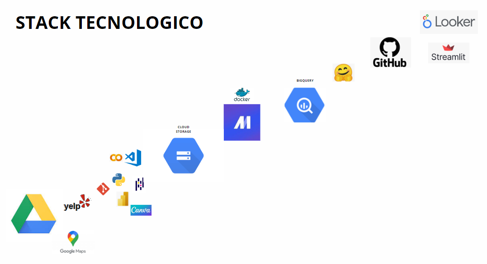

## Partes en el proceso Data Engineer

- [Cloud Storage](#cloud-storage)
- [Mage.ai](#mage.ai)
- [Bigquery](#bigquery)

## Cloud Storage

 

Cloud storage es un servicio que te permite almacenar, acceder y administrar tus archivos y datos a través de servidores remotos en la nube, ofreciendo flexibilidad, accesibilidad y seguridad. Además, ofrece la posibilidad de compartir archivos y colaborar en tiempo real con otras personas, lo que facilita el trabajo en equipo y la sincronización de datos.

Elegimos Google Cloud Services en general porque tienen una interfaz de usuario increíble, muy fácil de usar y muy completa. 

- Los datos descargados del drive, fueron almacenados en Google Storage.

 

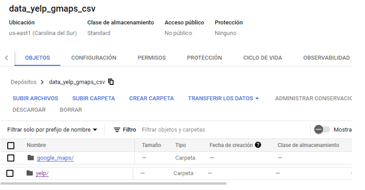

## Mage.ai

 

Mage es una herramienta de canalización de datos de código abierto para transformar e integrar datos.

- Porque elegimos Mage.ai, al ser una herramienta de código abierto y de una interface amigable e intuitiva, nos automatiza los procesos de ETL.

- Aqui una muestra de nuestro pipeline general en un inicio.

 

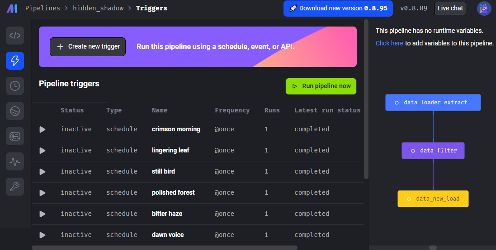

 

Te permite limpiar, transformar y organizar tus datos de manera más eficiente, lo que facilita la obtención de información útil y precisa a partir de ellos.

 

 Aquí su página oficial --> https://www.mage.ai/ 

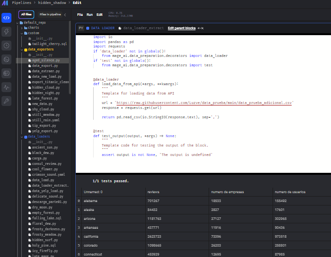

 

Loader, en esta etapa se extrae la data de cloud storage (1000 fila).

 

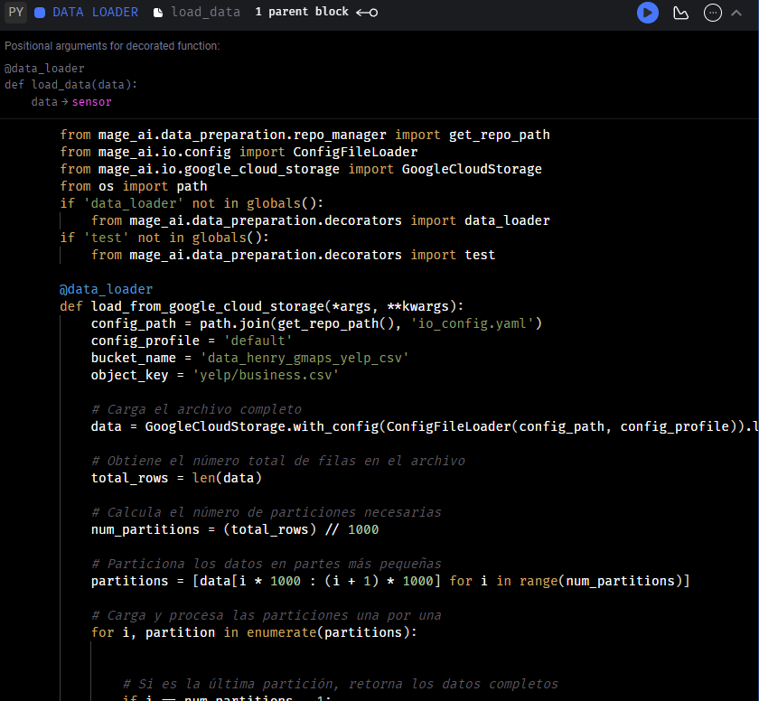

 

Transformer, en este proceso se ejecuta el ETL (remove_columns)

 

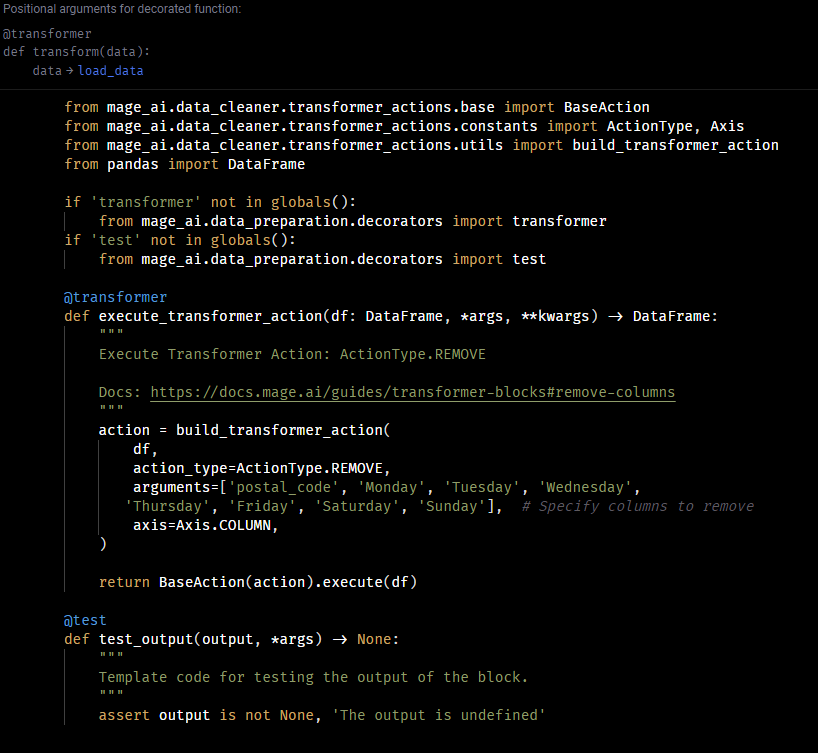

 

Export, aqui la data se almaena en bigquery.

 

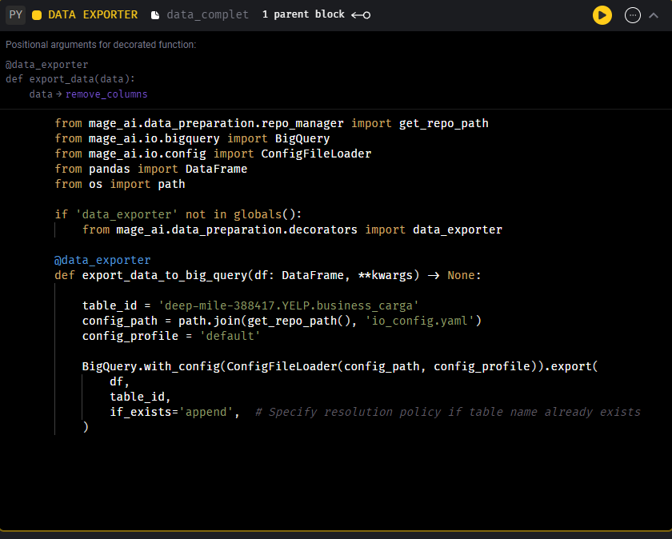

 

- Como puntos de mejora en este proyecto se pueden incluir sensores que ayuden a la ejecucion del pipeline(automatizacion).

 

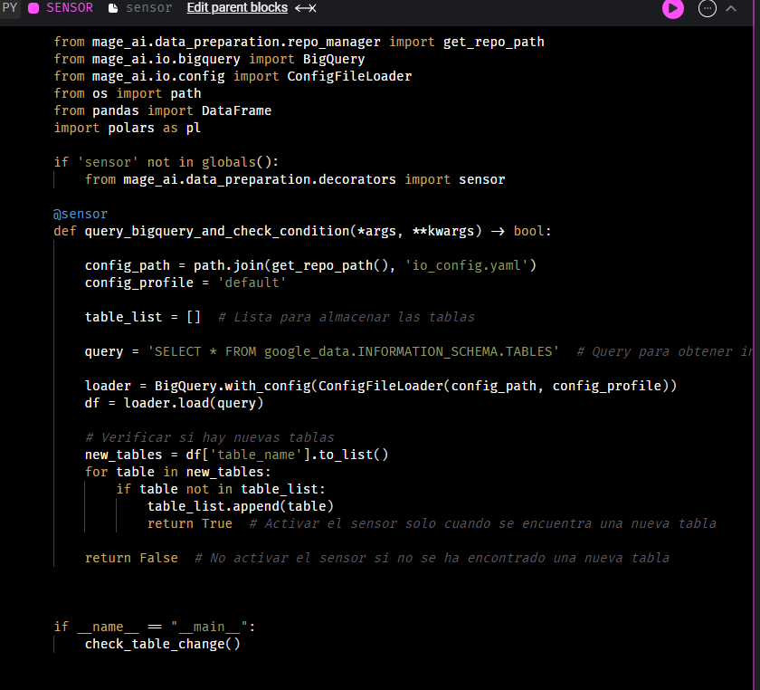

 

- Muestra de un pipeline con sensor.

 

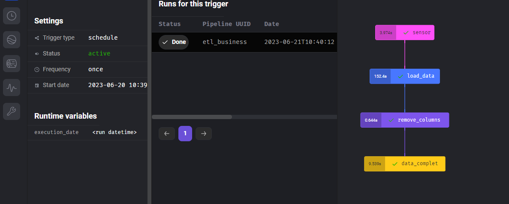

## Bigquery

 

 BigQuery es un servicio en la nube de Google que te permite almacenar, organizar y analizar grandes volúmenes de datos de manera eficiente. Te proporciona una potente capacidad de consulta y análisis para obtener información valiosa a partir de tus datos. La principal ventaja de BigQuery es su capacidad para realizar consultas y análisis rápidos en conjuntos de datos masivos. Puedes ejecutar consultas SQL para filtrar, combinar y agregar datos de manera flexible.

 

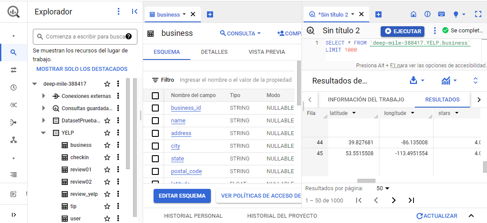

## Flujo de Trabajo

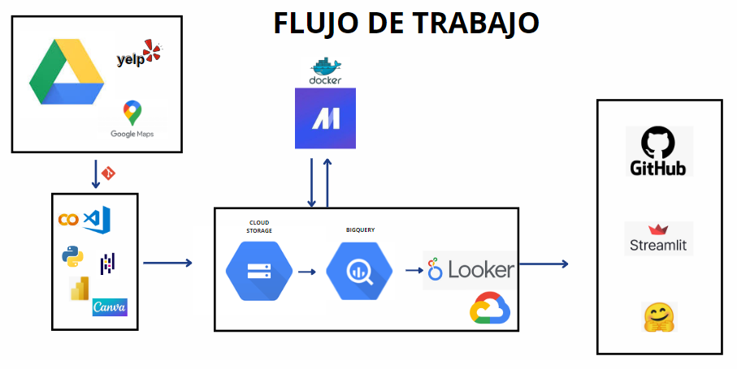

 

- **Video demo pipeline Mage** [(link)](https://drive.google.com/drive/folders/1k3WgKGuY7SWydOvDJU7oKH8ZJn8JlTHD?usp=sharing)  →  Turorial sobre el funcionamiento del pipeline con Mage, en formato video.

 

